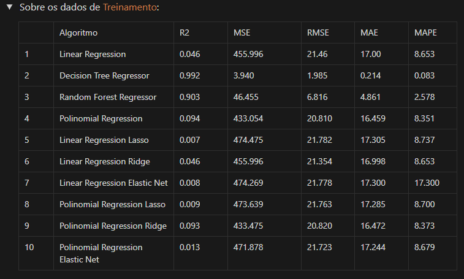
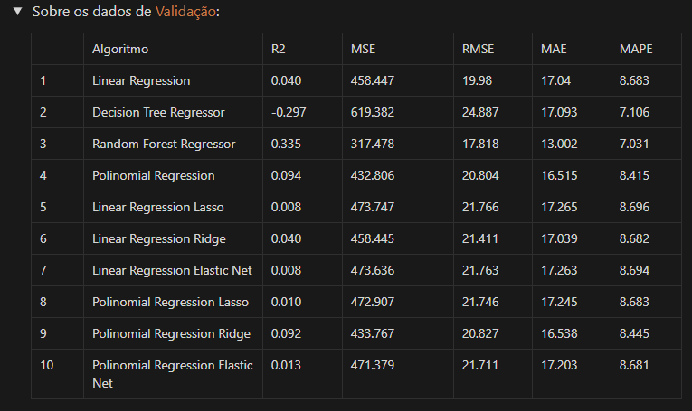

# Ensaio de Machine Learning

## Descrição

A empresa Data Money acredita que a expertise no treinamento e ajuste fino dos algoritmos, é um dos principais responsáveis pelos ótimos resultados que as consultorias estão entregando aos seus clientes.

## Objetivo

O objetivo desse projeto é realizar ensaios com algoritmos de Classificação, Regressão e Clusterização, afim de estudar as alterações do comportamento da performance em relação aos valores usados nos principais parâmetros de controle de overfitting e underfitting.

# Planejamento da solução

## Produto final

O produto final será 7 tabelas mostrando a performance dos algoritmos ensaiados, usando diversas métricas. Cada algoritmo foi ensaiado em 3 conjuntos de dados diferentes, são eles: Treinamento, Validação e Teste.

## Algoritmos ensaiados

### Classificação:

Algoritmos: KNN, Decision Tree, Random Forest e Logistic Regression.
Métricas de performance: Accuracy, Precision, Recall e F1-Score.

### Regressão:

Algoritmos: Linear Regression, Decision Tree Regressor, Random Forest Regressor, Polinomial Regression, Linear Regression Lasso, Linear Regression Ridge, Linear Regression Elastic Net, Polinomial Regression Lasso, Polinomial Regression Ridge e Polinomial Regression Elastic Net.
Métricas de performance: R2, MSE, RMSE, MAE e MAPE.

### Agrupamento:

Algoritmos: K-Means e Affinity Propagation.
Métricas de performance: Silhouette Score.

## Ferramentas utilizadas

Python 3.8 e Scikit-learn

# Desenvolvimento

## Estratégia da solução

Para atingir o objetivo do projeto, vou escrever códigos utilizando a linguagem Python, para treinar os algoritmos e vou variar os valores dos principais parâmetros de ajuste de overfitting e observar a métrica final. O conjunto de valores usados nos parâmetros que apresentarem a melhor performance, será escolhido para o treinamento final do algoritmo.

## O passo a passo

Passo 1: Divisão dos dados em treinamento, teste e validação.

Passo 2: Treinamento dos algoritmos com os dados de treinamento utilizando os parâmetros padrões (default).

Passo 3: Medir a performance dos algoritmos treinados com o parâmetro padrão, utilizando os dados de treinamento.

Passo 4: Medir a performance dos algoritmos treinados com o parâmetro padrão, utilizando o conjunto de dados de validação.

Passo 5: Alternar os valores dos principais parâmetros que controlam o overfitting do algoritmo, até encontrar o conjunto de valores que apresente a melhor performance.

Passo 6: Unir os dados de treinamento e validação.

Passo 7: Retreinar o algoritmo com a união dos dados de treinamento e validação, utilizando o melhor conjunto de valores para os parâmetros de controle do algoritmo.

Passo 8: Medir a performance dos algoritmos treinados com os melhores parâmetros, utilizando o conjunto de dados de teste.

Passo 9: Avaliar os ensaios e anotar os principais insights que se destacaram

# Os top 3 Insights

### Insight Top 1

Os algoritmos baseados em árvores possuem uma performance melhor em todas as métricas, nos ensaios de Classificação.

## Insight Top 2

A performance dos algoritmos de classificação sobre os dados de validação ficou bem próxima da performance dos dados de teste.

## Insight Top 3

Os algortimos de regressão tiveram uma performance ruim em todas as métricas, o que mostra que é necessário uma seleção de atributos e uma preparação melhor das variáveis independentes do conjunto de dados.

## Insight Top 4

No ensaio do algoritmo de clusterização, mesmo obtendo o número de clusters onde entregaria uma melhor performance,  não teve uma boa performance devido a baixa similaridade no conjunto de dados. 

## Insight Top 5

Por conta dos dados usados no ensaio do algoritmo de clusterização não terem uma boa similaridade, não houve uma estabilização na busca pelo melhor valor usado no principal parâmetro para o ensaio do algoritmo de Affinity Propagation.

# Resultados

## Ensaio de classificação:

### Sobre os dados de treinamento

]

### Sobre os dados de validação

### Sobre os dados de teste

## Ensaio de regressão:

### Sobre os dados de treinamento

### Sobre os dados de validação

### Sobre os dados de teste

## Ensaio de clusterização:

# Conclusão

Através desses ensaios de Machine Learning, obtive experiência e consegui entender melhor sobre os conjuntos de valores usados nos parâmetros a fim de buscar uma melhor performance nas métricas correspondentes.

Esses ensaios de Machine Learning foi muito importante para ter um melhor entendimento sobre o funcionamento de diversos algoritmos de classificação, regressão e clusterização e quais parâmetros mais influenciam para obter a melhor performance.
